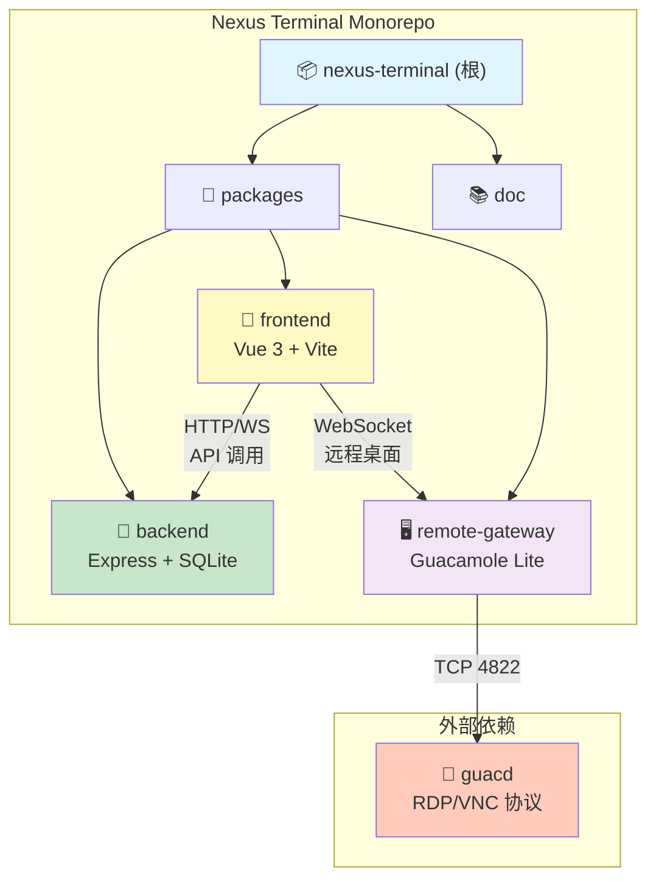
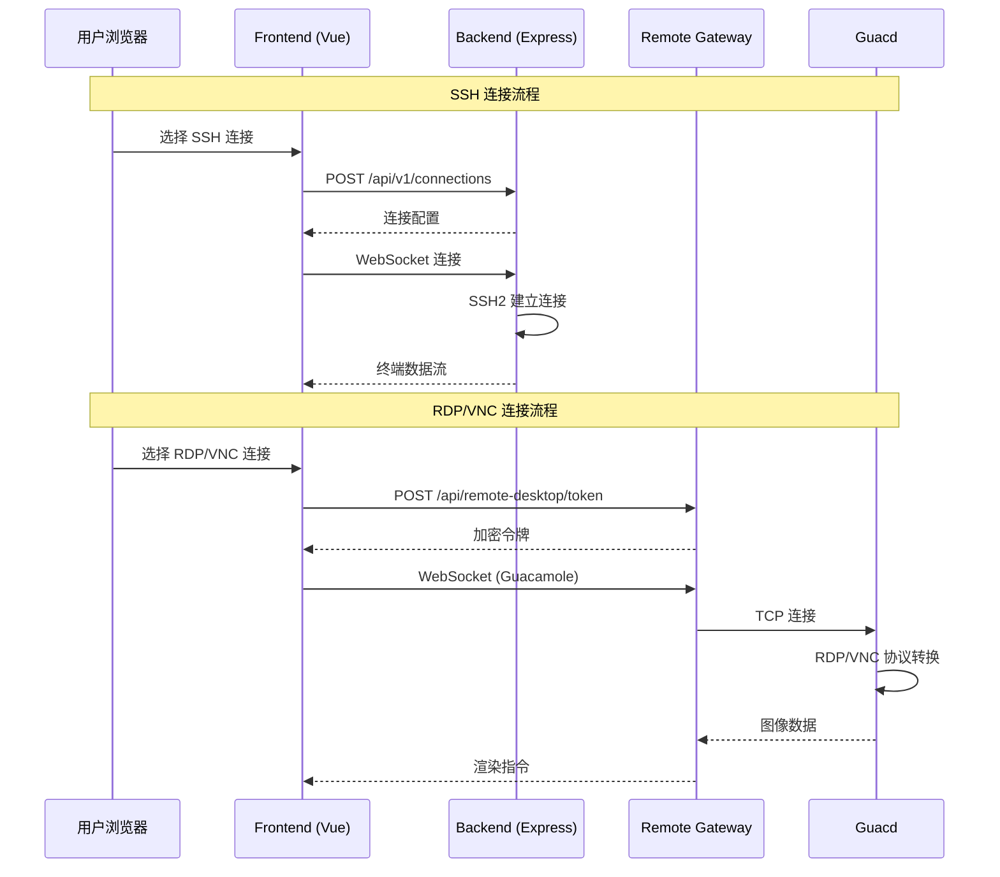

# 星枢终端（Nexus Terminal）

> 现代化、功能丰富的 Web SSH / RDP / VNC 客户端，提供高度可定制的远程连接体验

---

## 变更记录 (Changelog)

### 2025-12-24 (E2E 与集成测试框架实现)

- **Playwright E2E 测试框架**：
  - 新增目录：`packages/frontend/e2e/`
  - 配置文件：`playwright.config.ts`（支持 Chromium/Firefox/WebKit）
  - Page Object Model 设计：
    - `pages/login.page.ts`：登录页交互封装
    - `pages/workspace.page.ts`：工作区交互封装
    - `pages/settings.page.ts`：设置页交互封装
  - 测试 Fixtures：`fixtures/auth.fixture.ts`（认证状态管理）
  - 测试数据：`fixtures/test-data.ts`（SSH/RDP/VNC 连接配置）
  - E2E 测试用例：
    - `tests/auth.spec.ts`：认证流程（密码登录、2FA、Passkey）
    - `tests/ssh-connection.spec.ts`：SSH 连接与终端交互
    - `tests/sftp-operations.spec.ts`：SFTP 文件操作
    - `tests/remote-desktop.spec.ts`：RDP/VNC 远程桌面
- **SSH/SFTP 协议集成测试**：
  - 新增目录：`packages/backend/tests/integration/ssh/`、`packages/backend/tests/integration/sftp/`
  - Mock 服务器：`mock-ssh-server.ts`（MockSshServer、MockShellStream、MockSftpSession）
  - 测试用例：SSH 连接建立、Shell 操作、重连机制、SFTP 文件/目录操作
- **RDP/VNC 代理功能测试**：
  - 新增目录：`packages/backend/tests/integration/guacamole/`
  - 测试用例：
    - `guacamole.service.test.ts`：Token 生成与加密（AES-256-CBC）
    - `rdp-proxy.test.ts`：WebSocket 消息转发、Guacamole 协议解析
  - Remote Gateway 测试：`packages/remote-gateway/tests/server.test.ts`
- **测试脚本更新**：
  - 新增命令：`npm run test:e2e`、`npm run test:e2e:ui`、`npm run test:e2e:headed`
  - 新增依赖：`@playwright/test ^1.49.1`
- **测试结果**：Backend 59 个测试文件，1,223 个测试用例全部通过

### 2025-12-24 (安全增强与技术债务清零)

- **安全增强**：
  - bcrypt saltRounds 从 10 提升至 12（符合 2025 年安全标准）
  - 实现加密密钥轮换机制（`crypto.ts` 重构）
    - 支持多版本密钥共存
    - 新增 `rotateEncryptionKey()` / `reEncrypt()` / `getKeyRotationStatus()` API
    - 新加密格式：`[keyVersion(4B)][iv(16B)][encrypted][tag(16B)]`
    - 保持向后兼容：自动识别并解密旧格式数据
  - 代码审查报告 13 项问题全部修复（P0-P3）
- **技术债务清零**：24/24 项技术债务已全部修复（100%）
- **测试覆盖率大幅提升**：
  - 新增 20+ 测试文件（Backend + Frontend）
  - ESLint 配置优化，164 文件变更
- **文档状态**：所有核心模块文档已更新至最新状态

### 2025-12-24 00:09:22 (AI 上下文完整性验证)

- **覆盖率验证**：完成全仓扫描，确认模块文档完整性与数据准确性
- **文件统计更新**：
  - Backend: 177 个 TypeScript 文件
  - Frontend: 184 个 TypeScript/Vue 文件
  - Remote Gateway: 1 个 TypeScript 文件
  - **总计：362 个源代码文件**
- **测试框架确认**：Backend 与 Frontend 均已配置 Vitest 测试框架
- **索引更新**：更新 `.claude/index.json`，添加详细模块特性、测试配置、近期更新记录
- **文档状态**：所有核心模块文档（CLAUDE.md）已完整且最新，覆盖率 100%

### 2025-12-23 (技术债务整理)

- **技术债务报告**：新增 `doc/TECHNICAL_DEBT_REPORT.md`，完整分析代码库中的 TODO/FIXME 标记
- **发现数量**：24 个技术债务标记（Backend: 11 个，Frontend: 13 个）
- **优先级分类**：高优先级 7 个，中优先级 12 个，低优先级 5 个
- **问题分类**：错误处理缺失（10个）、安全/验证不完善（3个）、类型定义不精确（3个）等
- **处理建议**：按优先级分三批处理，预估总工作量 15-20 人天

### 2025-12-22 (Phase 6-11 规划)

- **个人版路线图草案**：新增 `doc/PERSONAL_ROADMAP.md`，聚焦单用户工作流
- **规划范围**：Phase 6-11 及长期愿景（AI Copilot、插件体系等）
- **实施策略**：分阶段列出 DB 结构、后端/前端目录规划、估算工期
- **定位重申**：强调无需多用户/权限体系，聚焦个人运维效率

### 2025-12-21 (Phase 3-5 功能实现)

- **Phase 3: WebSocket 基础设施升级** (Codex Review: 94/100 APPROVE)
  - 心跳机制：桌面/移动端差异化心跳检测 (`websocket/heartbeat.ts`)
  - 连接管理：客户端类型检测与验证 (`websocket/connection.ts`)
  - 状态广播：用户 Socket 映射与死连接清理 (`websocket/state.ts`)
  - 数据库索引：审计日志查询优化 (`schema.registry.ts`)

- **Phase 4: 批量作业模块** (Codex Review: 92/100 APPROVE)
  - 新增模块：`packages/backend/src/batch/`
  - 多服务器命令广播：支持并发执行、取消、进度追踪
  - 数据表：`batch_tasks`、`batch_subtasks`
  - WebSocket 实时进度推送

- **Phase 5: AI 智能运维模块** (Codex Review: 90/100 后端, 93/100 前端 APPROVE)
  - 后端模块：`packages/backend/src/ai-ops/`
    - AI 会话管理（UUID 标识）
    - 系统健康分析、命令模式分析、安全事件分析
    - 连接统计分析、自然语言查询路由
  - 前端模块：`packages/frontend/src/features/ai-ops/`
    - AIAssistantPanel 聊天组件（XSS 防护、自动滚动）
  - 前端模块：`packages/frontend/src/features/batch-ops/`
    - MultiServerExec 多服务器执行组件
  - 数据表：`ai_sessions`、`ai_messages`

### 2025-12-20 22:27:42 (增量更新)

- **模块文档完善**：为 3 个核心模块生成独立 CLAUDE.md 文档
- **导航面包屑**：为各模块文档添加返回根文档的导航链接
- **Mermaid 结构图**：更新模块结构图，添加模块间通信流程图
- **覆盖率更新**：已扫描 283 个源代码文件，模块覆盖率 100%

### 2025-12-20 22:27:42 (初始创建)

- **初始化架构文档**：完成项目架构分析与模块索引建立
- **模块识别**：识别 3 个核心模块（backend、frontend、remote-gateway）
- **技术栈确认**：TypeScript + Vue 3 + Express.js + SQLite3 + Docker

---

## 项目愿景

星枢终端致力于提供一个现代化、轻量级且功能完备的 Web 远程管理平台，支持：

- **多协议连接**：SSH、SFTP、RDP、VNC
- **多标签管理**：在单一浏览器窗口管理多个远程会话
- **会话挂起与恢复**：网络断开后自动保持会话，随时恢复
- **高度可定制**：终端主题、布局、背景动效、键盘映射
- **安全机制**：双因素认证（2FA）、Passkey 登录、IP 白名单/黑名单
- **审计与监控**：完整的用户行为日志、通知系统（Webhook/Email/Telegram）
- **轻量化部署**：基于 Node.js 后端，资源占用低，支持 Docker 一键部署

---

## 架构总览

### 技术栈

- **前端**：Vue 3 + TypeScript + Vite + Pinia + Element Plus + Xterm.js + Monaco Editor
- **后端**：Node.js + Express + TypeScript + SQLite3 + SSH2 + WebSocket
- **远程桌面网关**：Guacamole Lite + Express + WebSocket
- **部署**：Docker Compose + Nginx 反向代理

### 架构模式

- **Monorepo**：npm workspaces 管理三个子包
- **前后端分离**：RESTful API + WebSocket 实时通信
- **微服务架构**：后端服务、前端应用、远程网关独立容器化部署

### 核心能力

1. **会话管理**：支持 SSH 会话挂起/恢复、多标签页管理、自动重连
2. **文件管理**：基于 SFTP 的文件管理器，支持拖拽上传、多选、权限管理
3. **终端能力**：Xterm.js 提供全功能终端模拟，支持自定义主题、字体、快捷键
4. **远程桌面**：通过 Guacamole 协议代理 RDP/VNC 连接
5. **安全与审计**：用户认证、会话管理、IP 访问控制、行为审计日志
6. **通知系统**：可配置的多渠道通知（登录提醒、异常告警）
7. **容器管理**：内置简易 Docker 容器运维面板

---

## 模块结构图



### 模块通信流程图



---

## 模块索引

| 模块名称           | 路径                      | 语言/框架               | 文件数 | 职责描述                                                                | 文档入口                                                        |
| ------------------ | ------------------------- | ----------------------- | ------ | ----------------------------------------------------------------------- | --------------------------------------------------------------- |
| **backend**        | `packages/backend`        | TypeScript / Express.js | 177    | 后端 API 服务：SSH/SFTP 连接、用户认证、审计日志、通知、Docker 管理等   | [backend/CLAUDE.md](./packages/backend/CLAUDE.md)               |
| **frontend**       | `packages/frontend`       | TypeScript / Vue 3      | 184    | 前端 Web 应用：终端界面、文件管理器、连接管理、主题定制、路由与状态管理 | [frontend/CLAUDE.md](./packages/frontend/CLAUDE.md)             |
| **remote-gateway** | `packages/remote-gateway` | TypeScript / Express.js | 1      | 远程桌面网关：RDP/VNC 连接代理，基于 Guacamole 协议                     | [remote-gateway/CLAUDE.md](./packages/remote-gateway/CLAUDE.md) |

### 规划文档

| 文档                                                       | 描述                                                                                                                           |
| ---------------------------------------------------------- | ------------------------------------------------------------------------------------------------------------------------------ |
| [PERSONAL_ROADMAP.md](./doc/PERSONAL_ROADMAP.md)           | **个人版功能规划**：Phase 6-11 详细实施计划，包含命令模板、工作区快照、AI 推荐、知识库等功能的数据库设计、模块架构、工作量评估 |
| [TECHNICAL_DEBT_REPORT.md](./doc/TECHNICAL_DEBT_REPORT.md) | **技术债务报告**：完整分析代码库中的 24 个 TODO/FIXME 标记，按优先级分类，提供处理建议和 GitHub Issues 转换模板                |

---

## 运行与开发

### 快速启动（Docker）

```bash
# 1. 下载配置文件
mkdir nexus-terminal && cd nexus-terminal
wget https://raw.githubusercontent.com/Silentely/nexus-terminal/refs/heads/main/docker-compose.yml
wget https://raw.githubusercontent.com/Silentely/nexus-terminal/refs/heads/main/.env

# 2. 启动服务
docker compose up -d

# 3. 访问应用（默认端口 18111）
# 浏览器打开 http://localhost:18111
```

### 本地开发

```bash
# 安装依赖（根目录执行，会自动安装所有子包）
npm install

# 启动后端开发服务器（端口 3001）
cd packages/backend
npm run dev

# 启动前端开发服务器（端口 5173）
cd packages/frontend
npm run dev

# 启动远程网关开发服务器（端口 8080/9090）
cd packages/remote-gateway
npm run dev
```

### 构建生产版本

```bash
# 构建后端
cd packages/backend
npm run build
npm start

# 构建前端
cd packages/frontend
npm run build
```

### 环境变量配置

- **根目录 `.env`**：定义部署模式、端口等全局配置
- **data/.env**：定义后端加密密钥、Guacamole 连接信息（自动生成）
- **关键变量**：
  - `ENCRYPTION_KEY`：数据库敏感信息加密密钥（32字节 hex，支持密钥轮换）
  - `SESSION_SECRET`：会话密钥（自动生成）
  - `GUACD_HOST` / `GUACD_PORT`：Guacamole daemon 地址（默认 localhost:4822）
  - `RP_ID` / `RP_ORIGIN`：Passkey 登录配置
- **安全配置常量**：详见 [Backend CLAUDE.md](./packages/backend/CLAUDE.md#安全配置常量srcconfgsecurityconfigts)

---

## 测试策略

### 当前状态

- **测试框架已配置**：Backend 与 Frontend 均已配置完整测试框架
- **测试覆盖率**（2025-12-24 更新）：
  - Backend: 59 个 `*.test.ts` 文件，1,223 个测试用例（单元测试 + 集成测试）
  - Frontend: 15+ 个 `*.test.ts` 文件（组件、Store 与 Composables 测试）
  - E2E: 4 个 `*.spec.ts` 文件（Playwright 端到端测试）
- **测试类型覆盖**：
  - ✅ 单元测试（Vitest）
  - ✅ 集成测试（SSH/SFTP/RDP/VNC 协议模拟）
  - ✅ E2E 测试（Playwright）

### 测试框架配置

- **单元测试 (Vitest)**：
  - 后端：Vitest + @vitest/coverage-v8（配置：`packages/backend/vitest.config.ts`）
  - 前端：Vitest + Vue Test Utils + Happy DOM（配置：`packages/frontend/vite.config.ts`）
- **E2E 测试 (Playwright)**：
  - 配置文件：`packages/frontend/e2e/playwright.config.ts`
  - 支持浏览器：Chromium、Firefox、WebKit
  - Page Object Model：`e2e/pages/`（login、workspace、settings）
  - 测试 Fixtures：`e2e/fixtures/`（认证状态、测试数据）
- **集成测试**：
  - SSH/SFTP Mock 服务器：`packages/backend/tests/integration/ssh/mock-ssh-server.ts`
  - Guacamole 协议测试：`packages/backend/tests/integration/guacamole/`

### 测试命令

```bash
# 单元测试
npm test                          # 运行所有单元测试
npm run test:backend              # 运行后端测试
npm run test:frontend             # 运行前端测试
npm run test:watch:backend        # 后端监视模式
npm run test:watch:frontend       # 前端监视模式
npm run test:coverage             # 生成覆盖率报告

# E2E 测试
npm run test:e2e                  # 运行 E2E 测试（无头模式）
npm run test:e2e:ui               # Playwright UI 模式（交互式调试）
npm run test:e2e:headed           # 有头模式（可见浏览器）

# 首次运行 E2E 测试前需安装浏览器
npx playwright install
```

### 测试目录结构

```
packages/
├── backend/tests/
│   ├── integration/
│   │   ├── ssh/                  # SSH 集成测试
│   │   │   ├── mock-ssh-server.ts
│   │   │   └── ssh.integration.test.ts
│   │   ├── sftp/                 # SFTP 集成测试
│   │   │   └── sftp.integration.test.ts
│   │   └── guacamole/            # RDP/VNC 代理测试
│   │       ├── guacamole.service.test.ts
│   │       └── rdp-proxy.test.ts
│   └── unit/                     # 单元测试（与源码同目录）
│
├── frontend/
│   ├── e2e/                      # Playwright E2E 测试
│   │   ├── playwright.config.ts
│   │   ├── fixtures/
│   │   ├── pages/
│   │   └── tests/
│   └── src/**/*.test.ts          # 单元测试（与源码同目录）
│
└── remote-gateway/tests/
    └── server.test.ts            # 网关服务器测试
```

### 测试编写规范

本节基于代码库中现有测试用例总结，所有新增测试必须遵循以下规范。

#### 文件命名与位置

- **单元测试**：与被测文件同目录，命名为 `*.test.ts`（如 `auth.service.test.ts`）
- **集成测试**：放置于 `tests/integration/{功能}/` 目录
- **E2E 测试**：放置于 `e2e/tests/` 目录，命名为 `*.spec.ts`

#### 测试结构规范

```typescript
// 使用中文描述测试套件和用例
describe('服务名称', () => {
  // 前置设置
  beforeEach(() => {
    vi.clearAllMocks();
  });

  describe('方法名或功能分组', () => {
    it('应该 [预期行为描述]', async () => {
      // Arrange - 准备测试数据
      // Act - 执行被测方法
      // Assert - 验证结果
    });
  });
});
```

#### 后端 Service 测试规范

```typescript
import { describe, it, expect, beforeEach, vi } from 'vitest';
import { SomeService } from './some.service';
import { SomeRepository } from './some.repository';

// Mock Repository 层
vi.mock('./some.repository', () => ({
  SomeRepository: {
    findAll: vi.fn(),
    findById: vi.fn(),
    create: vi.fn(),
    update: vi.fn(),
    delete: vi.fn(),
  },
}));

describe('SomeService', () => {
  beforeEach(() => {
    vi.clearAllMocks();
  });

  describe('findAll', () => {
    it('应该返回所有记录', async () => {
      const mockData = [{ id: 1, name: 'test' }];
      vi.mocked(SomeRepository.findAll).mockResolvedValue(mockData);

      const result = await SomeService.findAll();

      expect(result).toEqual(mockData);
      expect(SomeRepository.findAll).toHaveBeenCalledTimes(1);
    });
  });
});
```

#### 前端 Pinia Store 测试规范

```typescript
import { describe, it, expect, beforeEach, vi } from 'vitest';
import { setActivePinia, createPinia } from 'pinia';
import { useSomeStore } from './some.store';

describe('SomeStore', () => {
  beforeEach(() => {
    // 每个测试前重新创建 Pinia 实例
    setActivePinia(createPinia());
  });

  it('应该有正确的初始状态', () => {
    const store = useSomeStore();
    expect(store.someState).toBe(initialValue);
  });

  it('应该正确执行 action', async () => {
    const store = useSomeStore();
    await store.someAction();
    expect(store.someState).toBe(expectedValue);
  });
});
```

#### 前端 Vue 组件测试规范

```typescript
import { describe, it, expect, beforeEach, vi } from 'vitest';
import { mount, VueWrapper } from '@vue/test-utils';
import { createPinia, setActivePinia } from 'pinia';
import SomeComponent from './SomeComponent.vue';

// Mock 依赖的 Composables
vi.mock('@/composables/useSomeComposable', () => ({
  useSomeComposable: () => ({
    someMethod: vi.fn(),
    someState: ref(initialValue),
  }),
}));

describe('SomeComponent', () => {
  let wrapper: VueWrapper;

  beforeEach(() => {
    setActivePinia(createPinia());
    wrapper = mount(SomeComponent, {
      global: {
        plugins: [createPinia()],
        stubs: ['el-button', 'el-input'], // Stub Element Plus 组件
      },
      props: {
        someProp: 'value',
      },
    });
  });

  it('应该正确渲染', () => {
    expect(wrapper.exists()).toBe(true);
  });

  it('应该响应用户交互', async () => {
    await wrapper.find('button').trigger('click');
    expect(wrapper.emitted('someEvent')).toBeTruthy();
  });
});
```

#### 集成测试 Mock 服务器规范

```typescript
import { EventEmitter } from 'events';

// 继承 EventEmitter 实现事件机制
export class MockSomeServer extends EventEmitter {
  private config: MockConfig;

  constructor(config: MockConfig) {
    super();
    this.config = config;
  }

  async start(): Promise<{ host: string; port: number }> {
    // 初始化逻辑
    return { host: '127.0.0.1', port: this.port };
  }

  async stop(): Promise<void> {
    // 清理逻辑
  }
}

// 工厂函数创建 Mock 客户端
export function createMockClient(address: { host: string; port: number }) {
  const client = new EventEmitter() as any;
  client.connect = vi.fn().mockImplementation(() => {
    setTimeout(() => client.emit('ready'), 10);
    return client;
  });
  return client;
}
```

#### 断言规范

| 场景           | 推荐断言                            | 示例                                          |
| -------------- | ----------------------------------- | --------------------------------------------- |
| 值相等         | `expect().toBe()`                   | `expect(result).toBe(5)`                      |
| 对象深度相等   | `expect().toEqual()`                | `expect(obj).toEqual({ a: 1 })`               |
| 数组包含元素   | `expect().toContain()`              | `expect(arr).toContain('item')`               |
| 对象包含属性   | `expect().toHaveProperty()`         | `expect(obj).toHaveProperty('key', 'value')`  |
| 函数被调用     | `expect().toHaveBeenCalled()`       | `expect(mockFn).toHaveBeenCalled()`           |
| 函数调用参数   | `expect().toHaveBeenCalledWith()`   | `expect(mockFn).toHaveBeenCalledWith('arg')`  |
| Promise 成功   | `expect().resolves`                 | `await expect(promise).resolves.toBe(value)`  |
| Promise 失败   | `expect().rejects`                  | `await expect(promise).rejects.toThrow()`     |
| 抛出异常       | `expect().toThrow()`                | `expect(() => fn()).toThrow('error message')` |
| 正则匹配       | `expect().toMatch()`                | `expect(str).toMatch(/pattern/)`              |
| 类型检查       | `expect().toBeInstanceOf()`         | `expect(obj).toBeInstanceOf(SomeClass)`       |
| 真值/假值      | `expect().toBeTruthy()/toBeFalsy()` | `expect(value).toBeTruthy()`                  |
| null/undefined | `expect().toBeNull()/toBeDefined()` | `expect(value).toBeDefined()`                 |

#### Mock 策略

| 依赖类型     | Mock 方式                                         |
| ------------ | ------------------------------------------------- |
| Repository   | `vi.mock('./some.repository')` + `vi.mocked()`    |
| 外部 API     | `vi.mock('axios')` 或 MSW (Mock Service Worker)   |
| Pinia Store  | `setActivePinia(createPinia())` + 直接操作 store  |
| Composables  | `vi.mock('@/composables/...')` 返回 mock 对象     |
| 定时器       | `vi.useFakeTimers()` + `vi.advanceTimersByTime()` |
| 环境变量     | `vi.stubEnv('VAR_NAME', 'value')`                 |
| Node 模块    | `vi.mock('fs')` / `vi.mock('path')`               |
| EventEmitter | 继承 EventEmitter 创建 Mock 类                    |

#### E2E 测试规范 (Playwright)

```typescript
import { test, expect } from '@playwright/test';
import { LoginPage } from '../pages/login.page';

test.describe('登录功能', () => {
  test('应该成功登录并跳转到仪表盘', async ({ page }) => {
    const loginPage = new LoginPage(page);
    await loginPage.goto();
    await loginPage.login('username', 'password');

    await expect(page).toHaveURL('/dashboard');
  });
});

// Page Object Model
class LoginPage {
  constructor(private page: Page) {}

  async goto() {
    await this.page.goto('/login');
  }

  async login(username: string, password: string) {
    await this.page.fill('[data-testid="username"]', username);
    await this.page.fill('[data-testid="password"]', password);
    await this.page.click('[data-testid="submit"]');
  }
}
```

#### 测试覆盖率要求

| 模块类型   | 行覆盖率目标 | 分支覆盖率目标 |
| ---------- | ------------ | -------------- |
| Service    | ≥80%         | ≥70%           |
| Controller | ≥70%         | ≥60%           |
| Repository | ≥60%         | ≥50%           |
| Utils      | ≥90%         | ≥80%           |
| Store      | ≥80%         | ≥70%           |
| Component  | ≥60%         | ≥50%           |

---

## 编码规范

### 语言与格式

- **语言**：TypeScript（严格模式）
- **代码风格**：基于项目内现有约定（建议配置 ESLint + Prettier）
- **命名约定**：
  - 文件名：`kebab-case`（如 `auth.controller.ts`）
  - 类名/接口：`PascalCase`
  - 变量/函数：`camelCase`
  - 常量：`UPPER_SNAKE_CASE`

### 架构约定

- **模块化**：后端按业务领域划分目录（`auth/`、`connections/`、`sftp/` 等）
- **分层架构**：
  - `routes.ts`：路由定义
  - `controller.ts`：请求处理与参数校验
  - `service.ts`：业务逻辑
  - `repository.ts`：数据访问
- **前端组合式 API**：Vue 3 使用 Composition API + Pinia stores
- **类型定义**：所有 API 交互与状态定义需有 TypeScript 类型

### 依赖管理

- **锁定版本**：生产依赖版本应在 `package.json` 中明确
- **安全更新**：定期检查依赖漏洞（`npm audit`）
- **避免重复**：跨模块共享依赖提升至根 `package.json`

---

## AI 使用指引

### 上下文注入优先级

1. **优先读取**：
   - 根 `CLAUDE.md`（本文件）：获取全局架构与规范
   - 模块 `CLAUDE.md`：获取具体模块的实现细节
   - `.claude/index.json`：获取模块索引与覆盖率信息
2. **按需读取**：
   - 数据模型定义：`packages/backend/src/database/schema.ts`
   - API 路由定义：`packages/backend/src/*/routes.ts`
   - 前端路由与状态：`packages/frontend/src/router/`、`packages/frontend/src/stores/`
   - 类型定义：`packages/*/src/types/*.ts`

### 任务执行建议

- **新增功能**：
  1. 先读取相关模块的 `CLAUDE.md` 了解现有架构
  2. 在对应模块的目录下创建新文件（遵循现有命名与分层约定）
  3. 更新模块 `CLAUDE.md` 的"相关文件清单"与"变更记录"
- **修改功能**：
  1. 识别影响范围（前端/后端/数据库）
  2. 读取相关文件的当前实现
  3. 修改后运行本地测试（如有）
  4. 更新相关文档与 Changelog
- **Bug 修复**：
  1. 在 `.claude/index.json` 中记录问题发现时间与描述
  2. 定位问题根源（日志、代码逻辑）
  3. 修复后更新测试用例（如适用）

### 提示词模板

#### 新增 API 端点

```
请在 backend 模块中新增一个 API 端点，用于[功能描述]。
- 路由路径：/api/v1/[资源名]
- HTTP 方法：[GET/POST/PUT/DELETE]
- 请求参数：[参数列表与类型]
- 响应格式：[JSON 结构]
- 数据表：[涉及的数据库表，如需新增表则提供 SQL schema]
- 权限要求：[是否需要认证中间件]

参考现有实现：packages/backend/src/[类似模块]
```

#### 新增前端组件

```
请在 frontend 模块中新增一个 Vue 组件，用于[功能描述]。
- 组件名称：[PascalCase]
- 放置路径：packages/frontend/src/components/[目录]/
- 依赖的 Store：[Pinia store 名称]
- 接口集成：[调用的后端 API]
- 样式要求：[Tailwind CSS 类或自定义样式]
- 交互逻辑：[用户操作流程]

参考现有实现：packages/frontend/src/components/[类似组件]
```

#### 数据库迁移

```
请添加数据库迁移，用于[描述变更内容]。
- 变更类型：[新增表/修改列/索引优化]
- SQL 语句：[提供 SQLite DDL]
- 影响的模块：[backend 中哪些 repository/service 需要同步更新]
- 数据兼容性：[如何处理已有数据]

修改文件：
- packages/backend/src/database/schema.ts
- packages/backend/src/database/migrations.ts
```

---

## AI 协作最佳实践

1. **上下文优先**：任务开始前，主动提供相关模块的 `CLAUDE.md` 和关键文件路径
2. **变更记录**：每次变更后，在模块 `CLAUDE.md` 顶部添加 Changelog 条目
3. **覆盖率跟踪**：修改后更新 `.claude/index.json` 中的 `lastUpdated` 和相关字段
4. **断点续扫**：如扫描因限制中断，记录下一步建议扫描的目录列表至 `gaps.recommendedNextSteps`
5. **问题反馈**：发现架构不一致或技术债务时，记录至模块 `CLAUDE.md` 的"常见问题 (FAQ)"

---

## 附录

### 项目关键文件路径速查

- **Docker 配置**：`docker-compose.yml`、`packages/backend/Dockerfile`
- **数据库 Schema**：`packages/backend/src/database/schema.ts`
- **后端入口**：`packages/backend/src/index.ts`
- **前端入口**：`packages/frontend/src/main.ts`
- **路由定义**：
  - 后端：`packages/backend/src/*/routes.ts`
  - 前端：`packages/frontend/src/router/index.ts`
- **状态管理**：`packages/frontend/src/stores/*.store.ts`
- **WebSocket**：
  - 服务端：`packages/backend/src/websocket.ts`
  - 处理器：`packages/backend/src/websocket/handlers/`
- **主题配置**：
  - 后端：`packages/backend/src/config/default-themes.ts`
  - 前端：`packages/frontend/src/features/appearance/config/`

### 部署架构

```
Nginx (80/443)
  ↓
Frontend Container (80) → 静态资源 (Vite build)
  ↓ API 代理
Backend Container (3001) → Express + SQLite + SSH2
  ↓ WebSocket
Remote Gateway (8080/9090) → Guacamole Lite
  ↓
Guacd (4822) → RDP/VNC 协议转换
```

### 数据持久化

- **SQLite 数据库**：挂载至 `./data` 目录
- **会话文件**：`./data/sessions`
- **上传文件**：`./packages/backend/uploads`（Docker 容器内）

---

**文档生成时间**：2025-12-24（E2E 与集成测试框架实现）
**已完成任务**：

- ✅ E2E 测试（Playwright）验证关键用户流程
- ✅ SSH/SFTP 协议交互集成测试
- ✅ RDP/VNC 代理功能测试

**下次扫描建议**：

- 监控 Phase 4/5 新增模块的测试覆盖率提升
- 定期审查技术债务报告并处理高优先级项
- 扩展 E2E 测试用例覆盖更多边缘场景
- 添加性能测试基准（响应时间、并发连接数）
