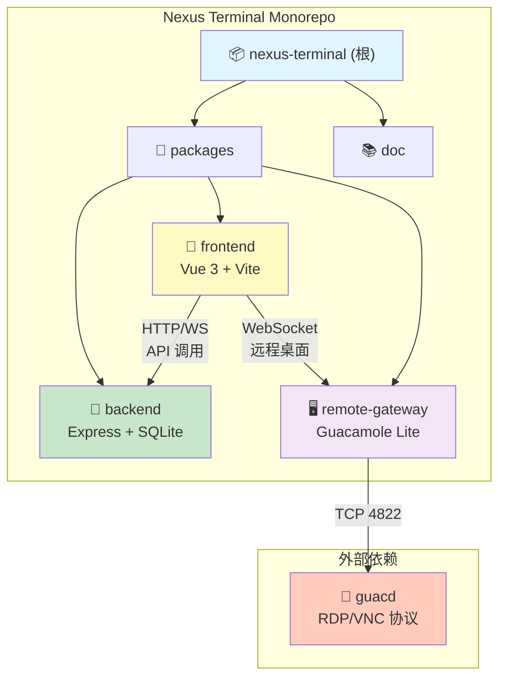
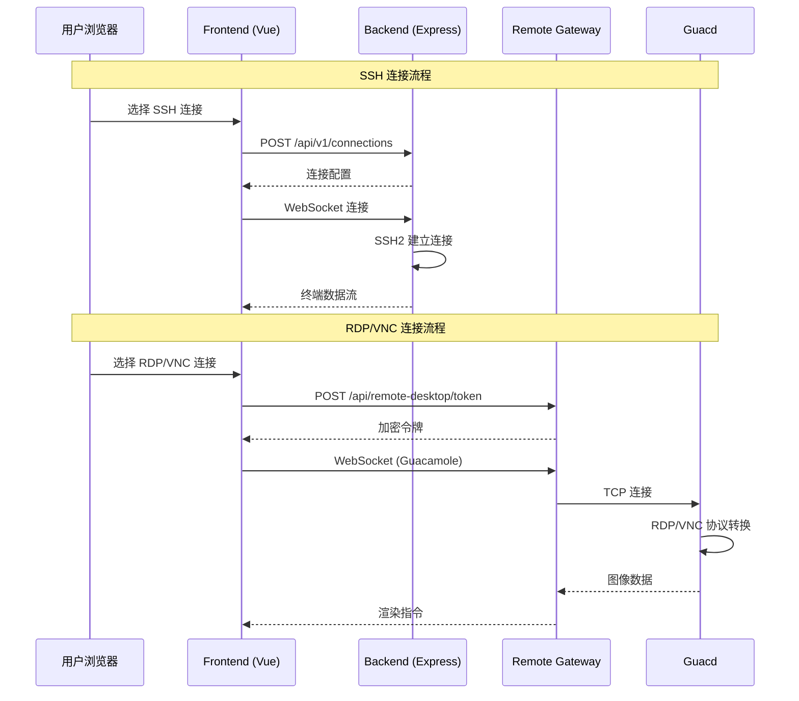

# 星枢终端（Nexus Terminal）

> 现代化、功能丰富的 Web SSH / RDP / VNC 客户端，提供高度可定制的远程连接体验

---

## 变更记录 (Changelog)

### 2025-12-21 (Phase 3-5 功能实现)
- **Phase 3: WebSocket 基础设施升级** (Codex Review: 94/100 APPROVE)
  - 心跳机制：桌面/移动端差异化心跳检测 (`websocket/heartbeat.ts`)
  - 连接管理：客户端类型检测与验证 (`websocket/connection.ts`)
  - 状态广播：用户 Socket 映射与死连接清理 (`websocket/state.ts`)
  - 数据库索引：审计日志查询优化 (`schema.registry.ts`)

- **Phase 4: 批量作业模块** (Codex Review: 92/100 APPROVE)
  - 新增模块：`packages/backend/src/batch/`
  - 多服务器命令广播：支持并发执行、取消、进度追踪
  - 数据表：`batch_tasks`、`batch_subtasks`
  - WebSocket 实时进度推送

- **Phase 5: AI 智能运维模块** (Codex Review: 90/100 后端, 93/100 前端 APPROVE)
  - 后端模块：`packages/backend/src/ai-ops/`
    - AI 会话管理（UUID 标识）
    - 系统健康分析、命令模式分析、安全事件分析
    - 连接统计分析、自然语言查询路由
  - 前端模块：`packages/frontend/src/features/ai-ops/`
    - AIAssistantPanel 聊天组件（XSS 防护、自动滚动）
  - 前端模块：`packages/frontend/src/features/batch-ops/`
    - MultiServerExec 多服务器执行组件
  - 数据表：`ai_sessions`、`ai_messages`

### 2025-12-20 22:27:42 (增量更新)
- **模块文档完善**：为 3 个核心模块生成独立 CLAUDE.md 文档
- **导航面包屑**：为各模块文档添加返回根文档的导航链接
- **Mermaid 结构图**：更新模块结构图，添加模块间通信流程图
- **覆盖率更新**：已扫描 283 个源代码文件，模块覆盖率 100%

### 2025-12-20 22:27:42 (初始创建)
- **初始化架构文档**：完成项目架构分析与模块索引建立
- **模块识别**：识别 3 个核心模块（backend、frontend、remote-gateway）
- **技术栈确认**：TypeScript + Vue 3 + Express.js + SQLite3 + Docker

---

## 项目愿景

星枢终端致力于提供一个现代化、轻量级且功能完备的 Web 远程管理平台，支持：
- **多协议连接**：SSH、SFTP、RDP、VNC
- **多标签管理**：在单一浏览器窗口管理多个远程会话
- **会话挂起与恢复**：网络断开后自动保持会话，随时恢复
- **高度可定制**：终端主题、布局、背景动效、键盘映射
- **安全机制**：双因素认证（2FA）、Passkey 登录、IP 白名单/黑名单
- **审计与监控**：完整的用户行为日志、通知系统（Webhook/Email/Telegram）
- **轻量化部署**：基于 Node.js 后端，资源占用低，支持 Docker 一键部署

---

## 架构总览

### 技术栈
- **前端**：Vue 3 + TypeScript + Vite + Pinia + Element Plus + Xterm.js + Monaco Editor
- **后端**：Node.js + Express + TypeScript + SQLite3 + SSH2 + WebSocket
- **远程桌面网关**：Guacamole Lite + Express + WebSocket
- **部署**：Docker Compose + Nginx 反向代理

### 架构模式
- **Monorepo**：npm workspaces 管理三个子包
- **前后端分离**：RESTful API + WebSocket 实时通信
- **微服务架构**：后端服务、前端应用、远程网关独立容器化部署

### 核心能力
1. **会话管理**：支持 SSH 会话挂起/恢复、多标签页管理、自动重连
2. **文件管理**：基于 SFTP 的文件管理器，支持拖拽上传、多选、权限管理
3. **终端能力**：Xterm.js 提供全功能终端模拟，支持自定义主题、字体、快捷键
4. **远程桌面**：通过 Guacamole 协议代理 RDP/VNC 连接
5. **安全与审计**：用户认证、会话管理、IP 访问控制、行为审计日志
6. **通知系统**：可配置的多渠道通知（登录提醒、异常告警）
7. **容器管理**：内置简易 Docker 容器运维面板

---

## 模块结构图



### 模块通信流程图



---

## 模块索引

| 模块名称 | 路径 | 语言/框架 | 职责描述 | 文档入口 |
|---------|------|-----------|---------|---------|
| **backend** | `packages/backend` | TypeScript / Express.js | 后端 API 服务：SSH/SFTP 连接、用户认证、审计日志、通知、Docker 管理等 | [backend/CLAUDE.md](./packages/backend/CLAUDE.md) |
| **frontend** | `packages/frontend` | TypeScript / Vue 3 | 前端 Web 应用：终端界面、文件管理器、连接管理、主题定制、路由与状态管理 | [frontend/CLAUDE.md](./packages/frontend/CLAUDE.md) |
| **remote-gateway** | `packages/remote-gateway` | TypeScript / Express.js | 远程桌面网关：RDP/VNC 连接代理，基于 Guacamole 协议 | [remote-gateway/CLAUDE.md](./packages/remote-gateway/CLAUDE.md) |

### 规划文档

| 文档 | 描述 |
|-----|------|
| [ROADMAP.md](./doc/ROADMAP.md) | 功能发展规划：基于 next-terminal 等项目的功能分析，包含 P0-P2 优先级功能规划、实施路线图、技术建议 |

---

## 运行与开发

### 快速启动（Docker）

```bash
# 1. 下载配置文件
mkdir nexus-terminal && cd nexus-terminal
wget https://raw.githubusercontent.com/Silentely/nexus-terminal/refs/heads/main/docker-compose.yml
wget https://raw.githubusercontent.com/Silentely/nexus-terminal/refs/heads/main/.env

# 2. 启动服务
docker compose up -d

# 3. 访问应用（默认端口 18111）
# 浏览器打开 http://localhost:18111
```

### 本地开发

```bash
# 安装依赖（根目录执行，会自动安装所有子包）
npm install

# 启动后端开发服务器（端口 3001）
cd packages/backend
npm run dev

# 启动前端开发服务器（端口 5173）
cd packages/frontend
npm run dev

# 启动远程网关开发服务器（端口 8080/9090）
cd packages/remote-gateway
npm run dev
```

### 构建生产版本

```bash
# 构建后端
cd packages/backend
npm run build
npm start

# 构建前端
cd packages/frontend
npm run build
```

### 环境变量配置

- **根目录 `.env`**：定义部署模式、端口等全局配置
- **data/.env**：定义后端加密密钥、Guacamole 连接信息（自动生成）
- **关键变量**：
  - `ENCRYPTION_KEY`：数据库敏感信息加密密钥（自动生成）
  - `SESSION_SECRET`：会话密钥（自动生成）
  - `GUACD_HOST` / `GUACD_PORT`：Guacamole daemon 地址（默认 localhost:4822）
  - `RP_ID` / `RP_ORIGIN`：Passkey 登录配置

---

## 测试策略

### 当前状态
- **无自动化测试**：项目暂无测试文件（未发现 `*.test.ts`、`*.spec.ts` 或 `__tests__` 目录）
- **测试缺口**：
  - 后端 API 单元测试与集成测试
  - 前端组件测试与端到端测试
  - SSH/SFTP 协议交互测试
  - RDP/VNC 代理功能测试

### 建议测试框架
- **后端**：Jest + Supertest（API 测试）
- **前端**：Vitest + Vue Test Utils + Cypress（E2E）
- **协议测试**：模拟 SSH/SFTP 服务器进行集成测试

---

## 编码规范

### 语言与格式
- **语言**：TypeScript（严格模式）
- **代码风格**：基于项目内现有约定（建议配置 ESLint + Prettier）
- **命名约定**：
  - 文件名：`kebab-case`（如 `auth.controller.ts`）
  - 类名/接口：`PascalCase`
  - 变量/函数：`camelCase`
  - 常量：`UPPER_SNAKE_CASE`

### 架构约定
- **模块化**：后端按业务领域划分目录（`auth/`、`connections/`、`sftp/` 等）
- **分层架构**：
  - `routes.ts`：路由定义
  - `controller.ts`：请求处理与参数校验
  - `service.ts`：业务逻辑
  - `repository.ts`：数据访问
- **前端组合式 API**：Vue 3 使用 Composition API + Pinia stores
- **类型定义**：所有 API 交互与状态定义需有 TypeScript 类型

### 依赖管理
- **锁定版本**：生产依赖版本应在 `package.json` 中明确
- **安全更新**：定期检查依赖漏洞（`npm audit`）
- **避免重复**：跨模块共享依赖提升至根 `package.json`

---

## AI 使用指引

### 上下文注入优先级
1. **优先读取**：
   - 根 `CLAUDE.md`（本文件）：获取全局架构与规范
   - 模块 `CLAUDE.md`：获取具体模块的实现细节
   - `.claude/index.json`：获取模块索引与覆盖率信息
2. **按需读取**：
   - 数据模型定义：`packages/backend/src/database/schema.ts`
   - API 路由定义：`packages/backend/src/*/routes.ts`
   - 前端路由与状态：`packages/frontend/src/router/`、`packages/frontend/src/stores/`
   - 类型定义：`packages/*/src/types/*.ts`

### 任务执行建议
- **新增功能**：
  1. 先读取相关模块的 `CLAUDE.md` 了解现有架构
  2. 在对应模块的目录下创建新文件（遵循现有命名与分层约定）
  3. 更新模块 `CLAUDE.md` 的"相关文件清单"与"变更记录"
- **修改功能**：
  1. 识别影响范围（前端/后端/数据库）
  2. 读取相关文件的当前实现
  3. 修改后运行本地测试（如有）
  4. 更新相关文档与 Changelog
- **Bug 修复**：
  1. 在 `.claude/index.json` 中记录问题发现时间与描述
  2. 定位问题根源（日志、代码逻辑）
  3. 修复后更新测试用例（如适用）

### 提示词模板

#### 新增 API 端点
```
请在 backend 模块中新增一个 API 端点，用于[功能描述]。
- 路由路径：/api/v1/[资源名]
- HTTP 方法：[GET/POST/PUT/DELETE]
- 请求参数：[参数列表与类型]
- 响应格式：[JSON 结构]
- 数据表：[涉及的数据库表，如需新增表则提供 SQL schema]
- 权限要求：[是否需要认证中间件]

参考现有实现：packages/backend/src/[类似模块]
```

#### 新增前端组件
```
请在 frontend 模块中新增一个 Vue 组件，用于[功能描述]。
- 组件名称：[PascalCase]
- 放置路径：packages/frontend/src/components/[目录]/
- 依赖的 Store：[Pinia store 名称]
- 接口集成：[调用的后端 API]
- 样式要求：[Tailwind CSS 类或自定义样式]
- 交互逻辑：[用户操作流程]

参考现有实现：packages/frontend/src/components/[类似组件]
```

#### 数据库迁移
```
请添加数据库迁移，用于[描述变更内容]。
- 变更类型：[新增表/修改列/索引优化]
- SQL 语句：[提供 SQLite DDL]
- 影响的模块：[backend 中哪些 repository/service 需要同步更新]
- 数据兼容性：[如何处理已有数据]

修改文件：
- packages/backend/src/database/schema.ts
- packages/backend/src/database/migrations.ts
```

---

## AI 协作最佳实践

1. **上下文优先**：任务开始前，主动提供相关模块的 `CLAUDE.md` 和关键文件路径
2. **变更记录**：每次变更后，在模块 `CLAUDE.md` 顶部添加 Changelog 条目
3. **覆盖率跟踪**：修改后更新 `.claude/index.json` 中的 `lastUpdated` 和相关字段
4. **断点续扫**：如扫描因限制中断，记录下一步建议扫描的目录列表至 `gaps.recommendedNextSteps`
5. **问题反馈**：发现架构不一致或技术债务时，记录至模块 `CLAUDE.md` 的"常见问题 (FAQ)"

---

## 附录

### 项目关键文件路径速查
- **Docker 配置**：`docker-compose.yml`、`packages/backend/Dockerfile`
- **数据库 Schema**：`packages/backend/src/database/schema.ts`
- **后端入口**：`packages/backend/src/index.ts`
- **前端入口**：`packages/frontend/src/main.ts`
- **路由定义**：
  - 后端：`packages/backend/src/*/routes.ts`
  - 前端：`packages/frontend/src/router/index.ts`
- **状态管理**：`packages/frontend/src/stores/*.store.ts`
- **WebSocket**：`packages/backend/src/websocket.ts`（待补充扫描）
- **主题配置**：
  - 后端：`packages/backend/src/config/default-themes.ts`
  - 前端：`packages/frontend/src/features/appearance/config/`

### 部署架构
```
Nginx (80/443)
  ↓
Frontend Container (80) → 静态资源 (Vite build)
  ↓ API 代理
Backend Container (3001) → Express + SQLite + SSH2
  ↓ WebSocket
Remote Gateway (8080/9090) → Guacamole Lite
  ↓
Guacd (4822) → RDP/VNC 协议转换
```

### 数据持久化
- **SQLite 数据库**：挂载至 `./data` 目录
- **会话文件**：`./data/sessions`
- **上传文件**：`./packages/backend/uploads`（Docker 容器内）

---

**文档生成时间**：2025-12-20 22:27:42（增量更新）
**下次扫描建议**：补充后端 WebSocket 消息协议文档、前端组件 Props/Events 接口定义、E2E 测试策略
